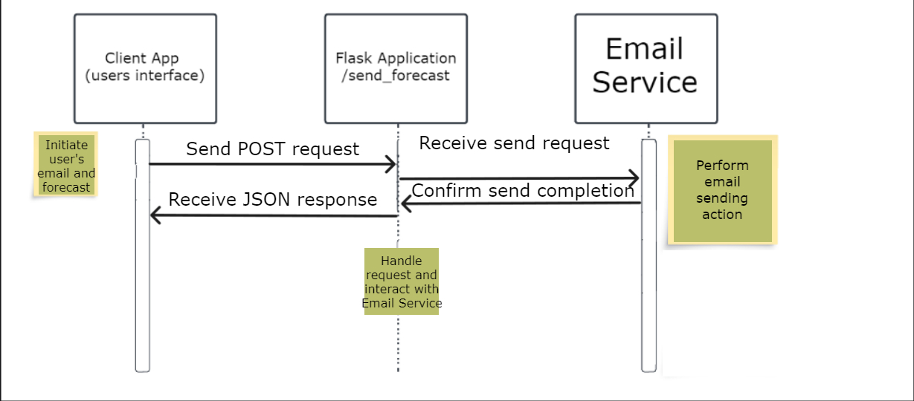

                                                Surf Forecast Microservice README

Overview: This microservice provides surf forecast info and sends it to a specified email address upon request. It's designed to be used programmatically through HTTP requests, making it a versatile component for web applications related to surf conditions and weather forecasting.

                                                    Communication Contract
Requesting Data:
To request surf forecast data to be sent via email, make a POST request to the /send_forecast endpoint. The request should include form data with two fields: email (the recipient's email address) and surf_forecast (the forecast information you wish to send).

Example Call Using Python's requests library:

=================================================================================================================================================
import requests

url = 'http://<your-domain-or-IP>:<port>/send_forecast'
data = {
    'email': 'user@example.com',
    'surf_forecast': 'Sunny with waves 3-5 feet'
}

response = requests.post(url, data=data)
print(response.text)
===============================================================================================================================================

Replace <your-domain-or-IP> and <port> with your server's domain name or IP address and the port where the Flask application is running.
For this project <your-domain-or-IP> = 127.0.0.1 & <port> = 333

Receiving Data: Upon successfully sending the email, the microservice will respond with a JSON object containing a success message.

Example Response:

========================================
{
  "message": "Email sent successfully!"
}
========================================

                                                            UML Sequence Diagram
